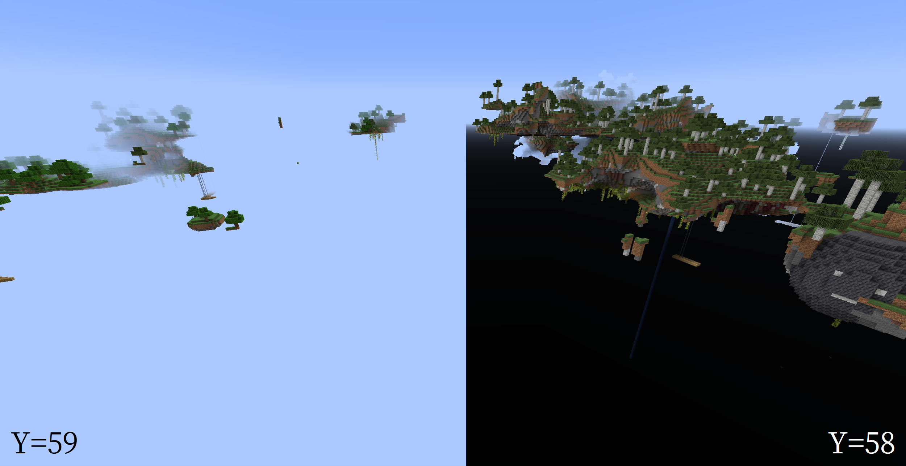

Clear Void
=====

[Download me on Modrinth](https://modrinth.com/mod/clear-void)

> [Sponsor](https://afdian.net/a/yezhiyi9670) if you like this project.

This is a simple mod that removes the pitch black bottom half of the skybox. You'll probably need this if you play skyblock-like modpacks.

Effect
-----

In vanilla Minecraft, when playing floating-islands worlds, you'll find that the bottom half of the skybox (the void) suddenly turning black when you go through Y=58. This is sometimes annoying.

This mod fixes that. The void will no longer suddenly turn black. Instead, it will gardually become dark when you go through Y levels below Y=-32.

Plans
-----

New features will not be added to the mod in order to keep the name descriptive. Please use [Github Issue Tracker](https://github.com/yezhiyi9670/clear-void/issues) to report bugs.

This mod will not be backported.
