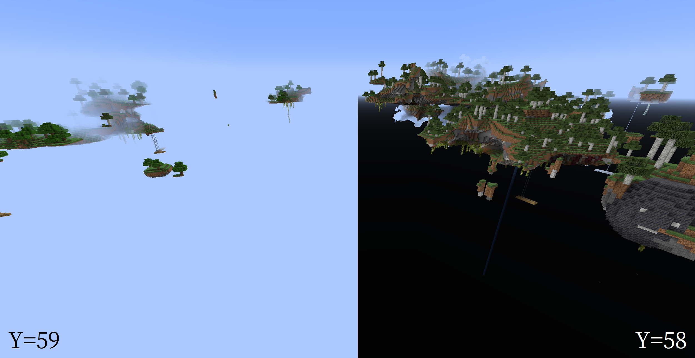

Clear Void
=====

> ⚠️ This branch is work-in-progress. Please add some patience.

> [Sponsor](https://afdian.com/a/yezhiyi9670) if you like this project.

This is a simple mod that removes the pitch black bottom half of the skybox. You will probably need this if you are playing in some sort of floating island world.

Effect
-----

In vanilla Minecraft, when playing floating-islands worlds, you'll find that the bottom half of the skybox (the void) suddenly turning black when you go through Y=58. This is annoying in floating island worlds.

With the mod, the void will no longer suddenly turn black. Instead, it will gardually become dark when you go through Y levels below Y=-32.

_Actually it will, but at 64 blocks below the min build height, so you will not encounter it unless you are dying in the void._

Reporting bugs
-----

Report bugs at [Github Issue Tracker](https://github.com/yezhiyi9670/clear-void/issues). Avoid using private messages since I might not check them.
